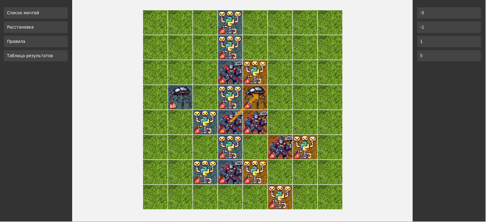
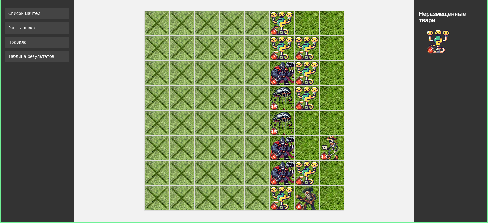

# Репозиторий новогодней олимпиады ЛКШ "Битвы сказочных тварей"

### Описание игры

При решении задачи в контесте каждая команда получает по какому-либо юниту.
Полученных юнитов команды могут расставлять на первые три строки шахматной доски для последующего
сражения с расстановками других команд.

Раз в 5 минут каждая команда участвует в сражении с какой-либо другой командой.
Победитель сражения получает sqrt(minutes_from_start) очков.
Места команд распределяются соответственно этим же очкам.

Порядок сражений составляется как полный круговой турнир, который повторяется до конца контеста.

Для более подробного ознакомления с правилами (в том числе описания всех юнитов)
можно почитать раздел с правилами на самом веб-сайте.

Интерфейс просмотра битвы:


Интерфейс расстановки юнитов:


### Post mortem 2024
В ЛКШ.Зима 2024 был выбран формат: 4 человека в команде, каждый со своим ноутбуком.

Все параллели были разделены на два дивизиона (параллели 3-5 и 6+).
В обоих контестах было по 21 задаче. По 20+ фигур от каждой из команд
почти убивает весь тактический замысел расстановок, поэтому было введено
ограничение на 16 фигур от команды.

Из-за нестабильного доступа к интернету, система хостилась
локально на одном преподавательском ноутбуке для обоих
дивизионов. Попыток DOS со стороны школьников не было, всё прошло без проблем.

* Контест младшего дивизиона оказался перегроблен (топ 1 команда младшего дивизиона решила всего 9 задач).
  Почти все отряды младшего дивизиона состояли только из обычной пехоты, что весьма скучно.

* В старшей контест решался лучше (топ 1 команда решила 16 задач), но за почти все задачи средние и простые задачи
  давали обычную пехоту.
  В результате лучник был всего у одной команды в одном экземпляре, полководца и туриста не было вообще ни у одной
  команды.

* Исходя из предыдущих двух пунктов, стоит не скупиться ставить интересных мобов на достаточно простые задачи, т.к. в противном случае
  есть шанс, что расстановка большинства команд будет состоять только из обычной пехоты (что очень скучно).

* Публиковать правила игры заранее! В противном случае на старте правила почти никто не читает, вместо этого
  все идут решать контест. Из-за этого половина команд узнала про игру только спустя полчаса-час после начала,
  во время обхода препами аудиторий.

* Как альтернатива (или дополнение) к предыдущему пункту: делать команды по 5-6 человек.

* Командам надо показывать следующего противника и его расстановку в прошлом матче, чтобы поднять мотивацию
  думать о расстановке своих юнитов перед матчем с противником.

* В целом идея такого контеста-игры участникам понравилась.


#### Организация подключения к БД ejudge
Если данное приложение хочется хостить не в локальной сети ejudge,
то необходимо прокинуть ssh туннель для к ejudge, т.к.
подключиться к БД можно только из локалки.

Самый простой способ, которым пользовались в 2024м году -- ssh туннель.
Таковой можно организовать командой:
```
ssh -N -L 127.0.0.1:8001:127.0.0.1:3306 ejudge
```

### Инструкция по проведению олимпиады
* скопировать serve.cfg контеста на ejudge в корень репозитория
* выставить правильные настройки в `src/sis_autochess/settings.py`. Помимо настроек в конце файла, необходимо не забыть
  проверить настройки подключения к ejudge и `ALLOWED_HOSTS`.
* раскоментить блок с кодом в конце файла `src/users/apps.py`, вызывающий `create_user`. Это костыль, чтобы автоматически
  при старте приложения создать нужных пользователей в БД приложения и подтянуть данные пользователей из ejudge.
* создать админовский аккаунт через `./manage.py createsuperuser`
* стартануть приложение через `./manage.py runserver`
* зайти в админку на `localhost:8000/admin`, перейти в `Fighters` и заполнить соответствие между short-name задачи на
  ejudge и тем, юнит какого типа даётся за её решение. Тут важно не забыть заполнить **все** задачи!
* закомментить блок кода в `src/users/apps.py`, создающий пользователей
* всё готово к старту! Осталось лишь снова запустить приложение через `./manage.py runserver`
  хорошо было бы запустить приложение заранее, чтобы участники могли ознакомиться с правилами.

По вопросам по системе можете писать в [телеграм](https://t.me/khaser1)

### Где что лежит
Список наиболее важных модулей:
* `src/battles/core` - логика сражения и поведение юнитов
* `src/battles` - сохранение и изменение расстановок пользователя, подсчёт очков, просмотр битв
* `src/tournament` - составление расписания битв

### TODOs
* сделать нормальную схему создания пользователей в БД приложения
* выводить в интерфейсе не login команды, а её название и участников
* показывать следующего противника и его расстановку в прошлой битве
* сделать страничку, которая отображает соответствие задачам на ejudge юниту, которого дают за её решение
  (в ЛКШ.Зима 2024 таковая была сделана вручную)
* хостить приложение не в DEBUG mode. Вероятно, всё что для этого необходимо это правильно настроить выдачу статики.
* вынести из `src/battles` подсчёт очков, привести в порядок views переписав их на genericViews
* автоматизировать составление расписания для турнира по зарегистрированным на ejudge командам

### Авторы
* Андрей Овчинников - реализация игровой логики сражения, web (html, css, js)
* Андрей Хорохорин - python django
* Федор Щурцов - web (html, css, js)
* Глеб Ткач - разработка идеи и баланс юнитов
